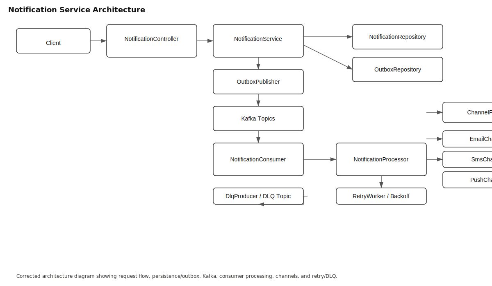

# Notification Service

A lightweight Spring Boot notification service that publishes and consumes notification events via Kafka, supports multiple delivery channels (email, SMS, push), and uses an outbox pattern for reliable delivery.

**Contents**
- [Overview](#overview)
- [Architecture](#architecture)
- [Key Components](#key-components)
- [Data Flow](#data-flow)
- [Decisions & Tradeoffs](#decisions--tradeoffs)
- [How to run](#how-to-run)
- [Where to look in the codebase](#where-to-look-in-the-codebase)
- [Future improvements](#future-improvements)

## Overview

This project implements a notification microservice built with Spring Boot and Apache Kafka. It receives requests to create notifications, persists them, emits domain events to Kafka, consumes events, and processes delivery through pluggable channels.

## Architecture

Architecture diagram (high-level):



Diagram notes:
- The service uses an outbox to ensure database and message broker write consistency.
- Kafka topics are defined in [src/main/java/com/dinesh/notificationservice/infrastructure/kafka/KafkaTopics.java](src/main/java/com/dinesh/notificationservice/infrastructure/kafka/KafkaTopics.java).

## Key Components

- **API**: NotificationController ([src/main/java/com/dinesh/notificationservice/api/controller/NotificationController.java](src/main/java/com/dinesh/notificationservice/api/controller/NotificationController.java)) — accepts HTTP requests.
- **Service layer**: NotificationService ([src/main/java/com/dinesh/notificationservice/domain/service/NotificationService.java](src/main/java/com/dinesh/notificationservice/domain/service/NotificationService.java)) — business logic and orchestration.
- **Persistence**: NotificationRepository, OutboxRepository ([src/main/java/com/dinesh/notificationservice/infrastructure/repository/NotificationRepository.java](src/main/java/com/dinesh/notificationservice/infrastructure/repository/NotificationRepository.java)).
- **Messaging**: NotificationProducer, NotificationConsumer, OutboxPublisher ([src/main/java/com/dinesh/notificationservice/infrastructure/messaging](src/main/java/com/dinesh/notificationservice/infrastructure/messaging)).
- **Worker/Processing**: NotificationProcessor, channel implementations ([src/main/java/com/dinesh/notificationservice/worker](src/main/java/com/dinesh/notificationservice/worker)).

## Data Flow

1. Client hits `POST /notify` handled by `NotificationController`.
2. Controller calls `NotificationService` which validates and persists a `Notification` entity.
3. A corresponding `OutboxEvent` is created and saved to the outbox table.
4. `OutboxPublisher` publishes the event to Kafka topics.
5. `NotificationConsumer` consumes events and hands them to `NotificationProcessor`.
6. `NotificationProcessor` routes to a channel via `ChannelFactory` (email/sms/push) and attempts delivery.
7. If delivery fails, retry logic in `RetryWorker`/`RetryBackoffCalculator` handles backoff and dead-lettering (`DlqProducer`).

## Decisions & Tradeoffs

- Outbox Pattern: chosen to guarantee atomicity between DB writes and Kafka publishes in environments without distributed transactions. Tradeoff: additional storage and publishing complexity; requires a background publisher (`OutboxPublisher`).
- Kafka for async delivery: provides scalability and decoupling. Tradeoff: operational complexity (brokers, partitioning, monitoring) versus simpler alternatives like in-process queues.
- Pluggable Channels: `ChannelFactory` enables switching/adding channels with minimal code changes. Tradeoff: slightly more indirection and abstraction.
- Retry Strategy: exponential backoff via `RetryBackoffCalculator` and dedicated `RetryWorker` gives robust delivery attempts. Tradeoff: increased implementation complexity and potential duplicate-delivery handling requirements.
- DLQ (Dead Letter Queue): failed events are routed to a DLQ topic using `DlqProducer`. This simplifies failure handling but requires human/operator processes to inspect and repair DLQ messages.
- Synchronous API response: The controller responds quickly after persisting and scheduling an outbox publish, improving client latency at the cost of eventual consistency for delivery.

## How to run

- Start Kafka and Zookeeper (local or docker)

```bash
# With Docker Compose (if you have Kafka compose services available)
docker-compose up -d

# Build and run the app
./mvnw clean package
./mvnw spring-boot:run
```

- Configuration is in [src/main/resources/application.properties](src/main/resources/application.properties).

## Where to look in the codebase

- Application entry: [src/main/java/com/dinesh/notificationservice/Application.java](src/main/java/com/dinesh/notificationservice/Application.java)
- API layer: [src/main/java/com/dinesh/notificationservice/api/controller/NotificationController.java](src/main/java/com/dinesh/notificationservice/api/controller/NotificationController.java)
- Domain: [src/main/java/com/dinesh/notificationservice/domain/model](src/main/java/com/dinesh/notificationservice/domain/model)
- Messaging infra: [src/main/java/com/dinesh/notificationservice/infrastructure/messaging](src/main/java/com/dinesh/notificationservice/infrastructure/messaging)
- Worker: [src/main/java/com/dinesh/notificationservice/worker](src/main/java/com/dinesh/notificationservice/worker)

## Testing

- Unit tests are under `src/test/java` (run with `./mvnw test`).
- Integration tests should run against a Kafka test fixture or a testcontainer-based Kafka.

## Future improvements

- Add idempotency keys and de-dup handling for exactly-once delivery semantics.
- Add metrics and distributed tracing (Prometheus + OpenTelemetry).
- Provide Kubernetes manifests and Helm chart for production deployment.
- Add automated DLQ replay tooling and a small web UI for observability.

---

If you want, I can also:

- add a UML diagram image file to the repo;
- add a `docker-compose.kafka.yml` example for local testing;
- or create CONTRIBUTING and CODE_OF_CONDUCT stubs.
